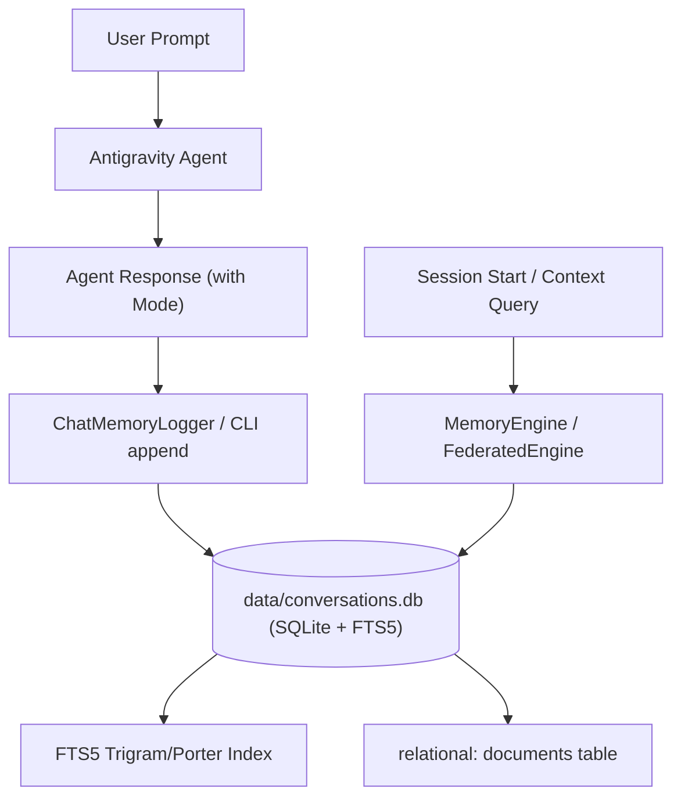

# Technical Specification & Plan: Migrating `prompt.log` to Real-Time Memory Engine Ingestion

## 1. Executive Summary & Objective

Currently, Rule 5 of Global Customizations requires logging all user prompts and model responses sequentially into a flat text file (`prompt.log`):
```text
All prompts input and outputs from chat independent of the mode should go into file named prompt.log immediately after providing answer with any changes. Also at the start of the application (cursor) in given project check and read prompt.log file.
```

While functional for small sessions, flat file logging degrades as conversation history scales (currently >1,380 lines and growing), making sequential text scanning inefficient, unsearchable by semantic relevance, and prone to concurrency write locks.

This specification outlines the architecture and phased plan to replace raw `prompt.log` appending with structured, real-time ingestion into a dedicated **SQLite FTS5 Memory Context Database** (`data/conversations.db` or bound to a `conversations` dataset), leveraging the project's own `MemoryEngine` and `Archive Memory Context Engine` CLI tools.

---

## 2. Target Architecture



### Key Architectural Tenets:
1. **Zero External Dependencies:** Built entirely upon the existing Groovy + SQLite JDBC (`org.xerial:sqlite-jdbc`) stack.
2. **Sub-Millisecond Retrieval:** Conversation turns become full-text searchable via BM25 relevance ranking and column-scoped filters (e.g. `archive:session_20260824`, `file_name:turn_001.md`).
3. **Structured Document Model:** Each interaction turn is formatted as a structured Markdown document containing timestamp, mode, user request, tool executions, and model response.
4. **Transparent Compression:** Older conversation turns can be compressed in-place via zlib BLOB compression (`compress --archive conversation_history --db conversations.db`).
5. **Dataset Federation:** The `conversations.db` can be added to the `default` dataset or a dedicated `chat_history` dataset for unified cross-repository search.

---

## 3. Data Model & Document Representation

### 3.1 Document Storage Structure
In `data/conversations.db`, records will be stored in the standard `documents` and `documents_fts` schema:

| Column | Value / Pattern |
| :--- | :--- |
| `archive_name` | `conversation_history` (or `session_<conversation_id>`) |
| `file_path` | `sessions/<session_id>/turn_<YYYYMMDD_HHMMSS>_<turn_idx>.md` |
| `file_name` | `turn_<YYYYMMDD_HHMMSS>_<turn_idx>.md` |
| `extension` | `.md` |
| `content` | Structured Markdown payload of the interaction |
| `size_bytes` | Payload byte count |
| `is_compressed`| `0` (or `1` if compressed) |

### 3.2 Structured Turn Payload Format
```markdown
---
timestamp: 2026-08-24T01:58:14+02:00
session_id: fcde74a2-7d0b-4cb7-9b64-c35f6b557f99
turn_index: 42
mode: EXECUTE
tools_called: ["run_command", "replace_file_content"]
status: SUCCESS
---

## User Request
<raw user prompt>

## Agent Response
<model response text and actions>
```

---

## 4. Proposed Components & Implementation Modules

### 4.1 `lib/ChatMemoryLogger.groovy` (Dedicated Ingestion Utility)
A high-speed, thread-safe helper class responsible for:
- Resolving the active conversation database (`data/conversations.db` or via `Config.DATA_DIR`).
- Formatting the interaction turn metadata and Markdown body.
- Invoking `MemoryEngine.appendDocument(...)` or `MemoryEngine.insertDocument(...)`.
- Ensuring immediate FTS5 index synchronization.

### 4.2 `scripts/migrate_prompt_log.groovy` (Historical Backfill Script)
A migration tool to parse the existing `prompt.log` file:
- Regex parsing of existing `[YYYY-MM-DDTHH:MM:SS] USER REQUEST:` and `[YYYY-MM-DDTHH:MM:SS] AGENT RESPONSE (MODE: ...):` blocks.
- Extracting individual interaction turns.
- Ingesting all historic entries into `data/conversations.db` under archive `legacy_prompt_log`.
- Verifying FTS5 index counts and queryability.

### 4.3 CLI Integration in `run.groovy` / `03_query_memory.groovy`
- **CLI Logging Command:**
  ```bash
  groovy run.groovy log --user "..." --agent "..." --mode "EXECUTE" [--db conversations.db]
  ```
- **Conversation Querying:**
  ```bash
  groovy run.groovy query "dataset create" --db conversations.db --limit 5
  ```
- **Recent Turns Inspection:**
  ```bash
  groovy run.groovy query ":doc" --db conversations.db --all
  ```

---

## 5. Antigravity Rule Definition (`.agents/rules/conversation-memory.md`)

Once implemented, Rule 5 will be updated with the following explicit directive:

```markdown
# Rule 5: Real-Time Conversation Memory Ingestion (Replacing prompt.log)

1. Independent of active mode, immediately record each conversation turn (User Request + Agent Response + Mode + Timestamp) into the Memory Context Database:
   - Command: `groovy run.groovy log --user "<prompt>" --agent "<response>" --mode "<mode>" --db data/conversations.db`
   - Or programmatic invocation via `lib/ChatMemoryLogger.groovy`.
2. At session initialization, check and query `data/conversations.db` for recent context and previous architectural decisions:
   - `groovy run.groovy query ":files" --db data/conversations.db --limit 10`
   - `groovy run.groovy query "<topic>" --db data/conversations.db`
3. Raw file appending to `prompt.log` is deprecated and superseded by `data/conversations.db`.
```

---

## IMPLEMENTATION CHECKLIST

```md
IMPLEMENTATION CHECKLIST: CONVERSATION MEMORY DATABASE MIGRATION
1. Design and implement lib/ChatMemoryLogger.groovy providing atomic turn formatting, metadata header generation, and MemoryEngine ingestion.
2. Add log entrypoint subcommand in run.groovy and 02_ingest_archive.groovy / 03_query_memory.groovy supporting single-turn command-line recording.
3. Create scripts/migrate_prompt_log.groovy to parse existing prompt.log and backfill all historic turns into data/conversations.db.
4. Execute migration script and verify data/conversations.db integrity (FTS5 search, :stats, :files).
5. Add automated unit test group in tests/test_query_suite.groovy validating turn logging, multi-turn FTS5 retrieval, and :doc inspection on conversations.db.
6. Create Antigravity customization rule in .agents/rules/conversation-memory.md codifying the transition from prompt.log to conversations.db.
7. Update docs/implementation.md and docs/semantic_titles.md.
```
